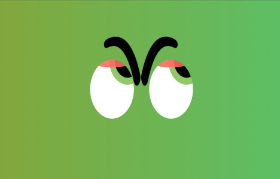

# Eye Ball Movement

Aim of the project is to rotate the eye ball where the cursor goes

## Screenshots

## Demo

## Tech Stack

**Front-end:** HTML , CSS , JS

## Authors

- [@Hanssickennady](https://github.com/Hanssickennady)

## Support

For support, email hanssickennady@gmail.com

